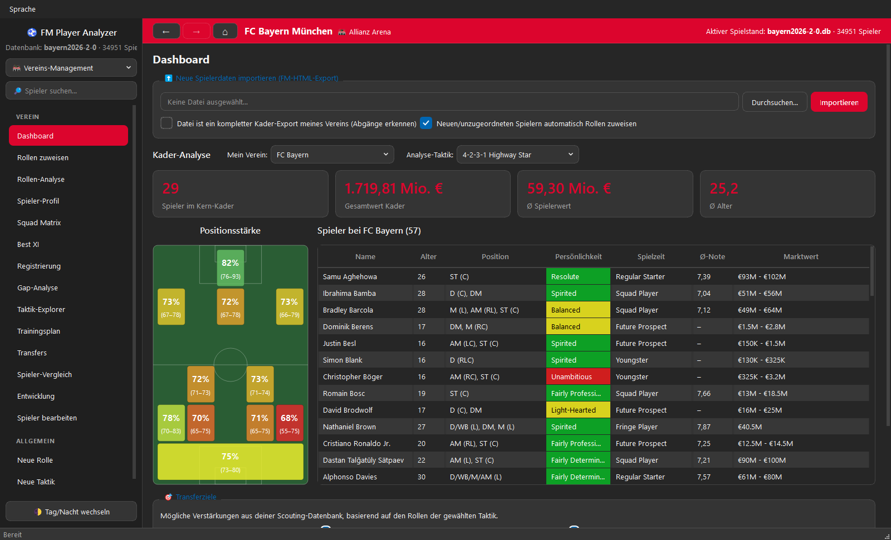
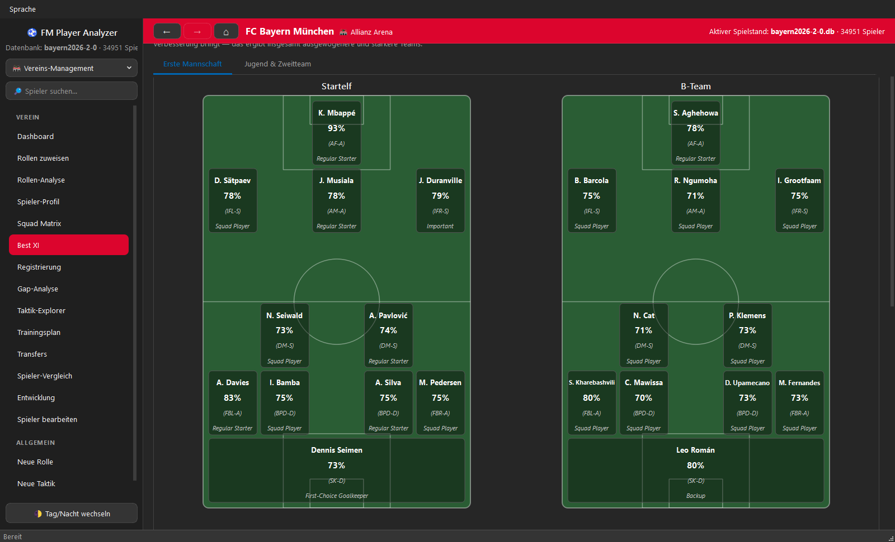
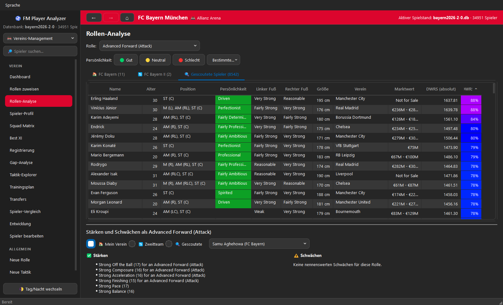
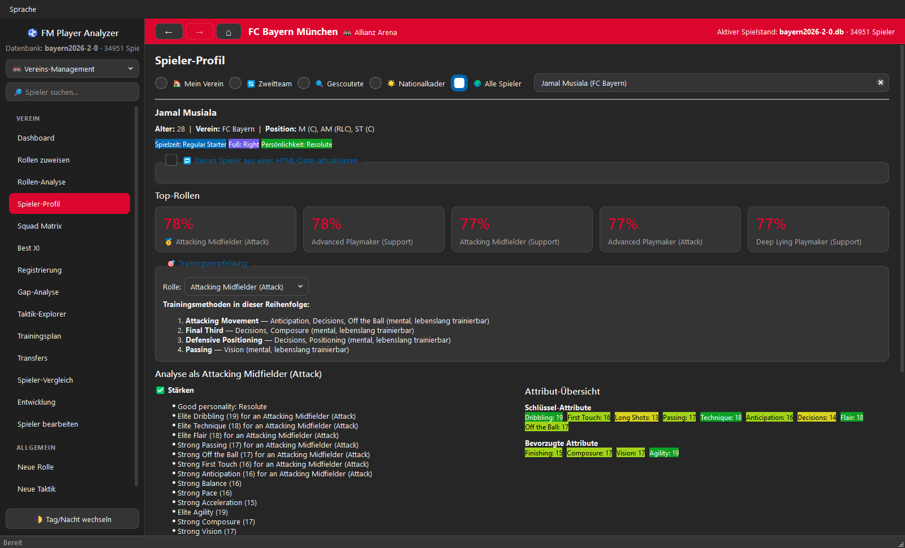
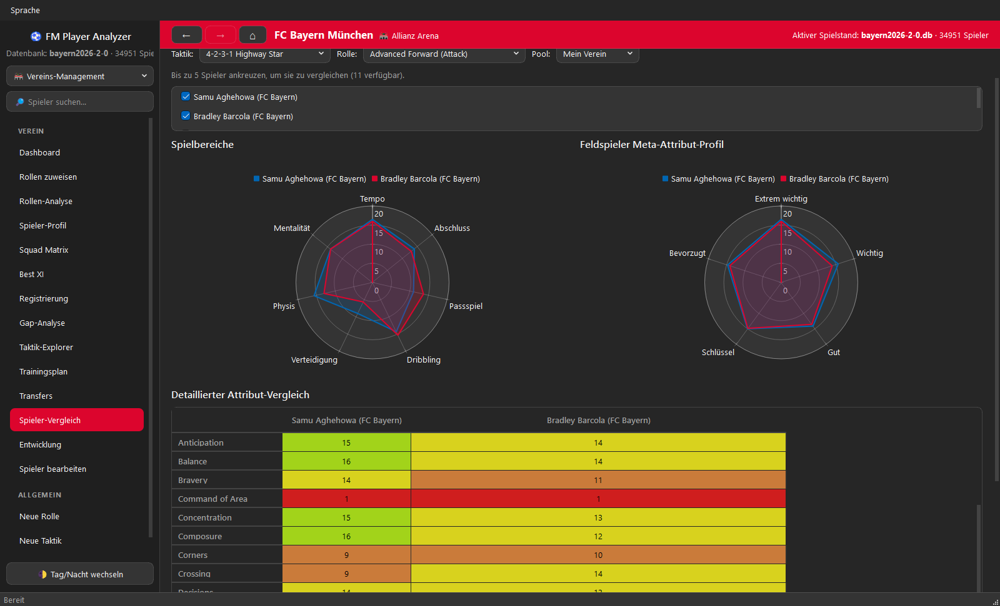
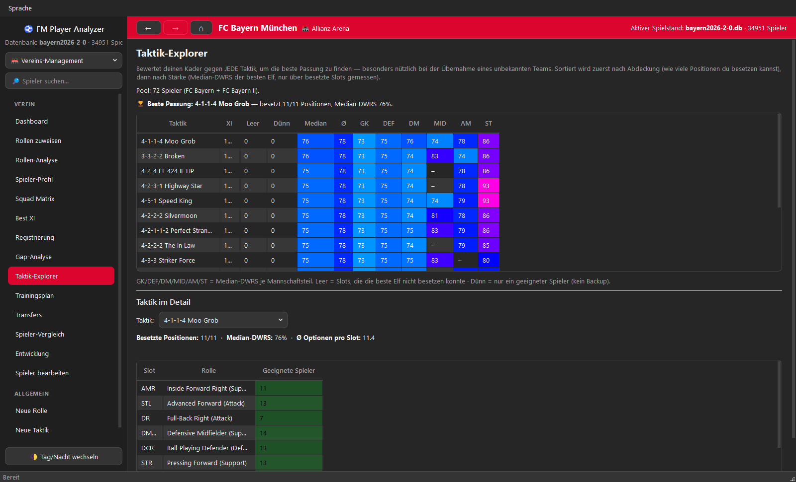
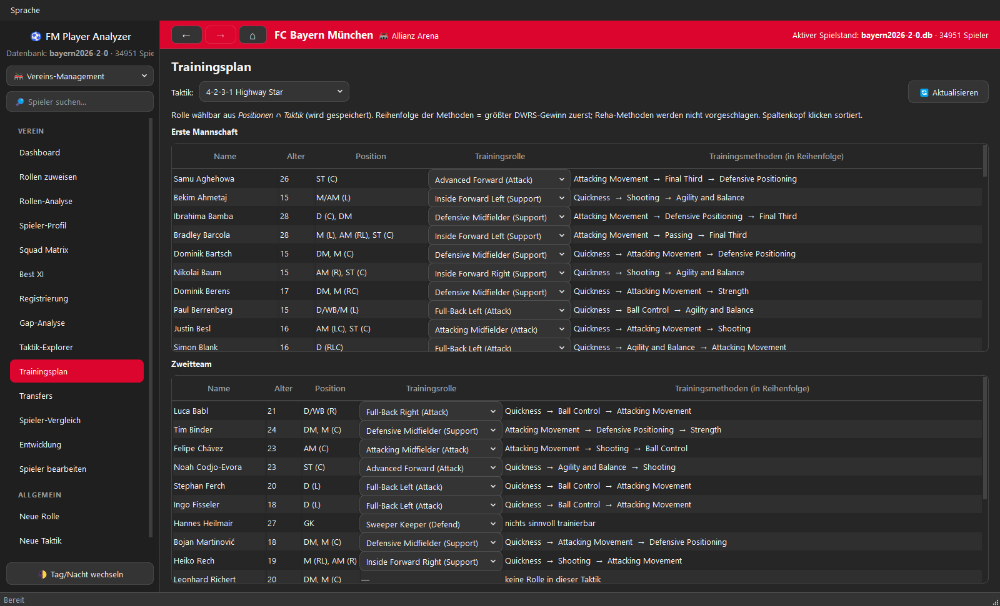
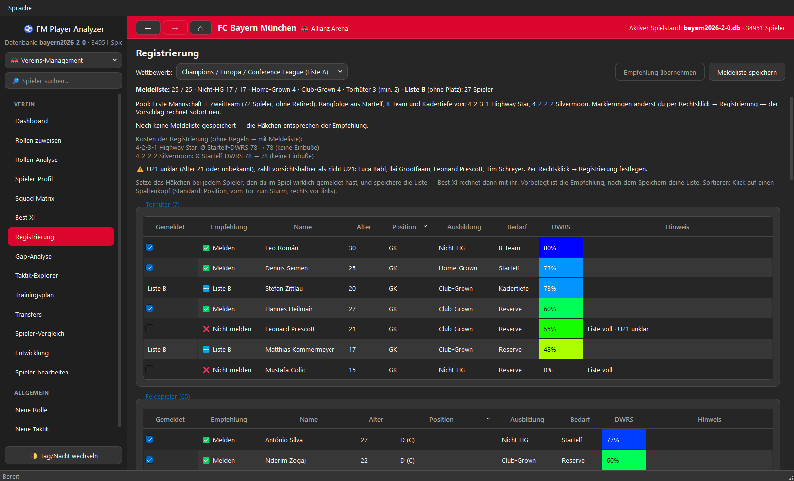
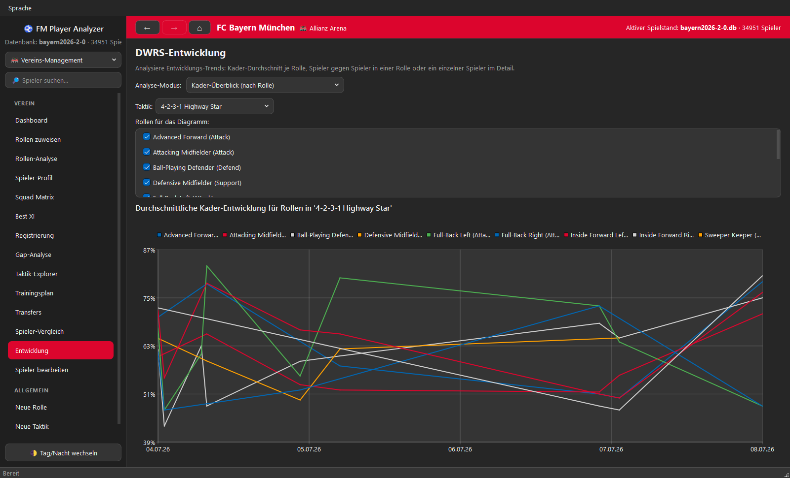
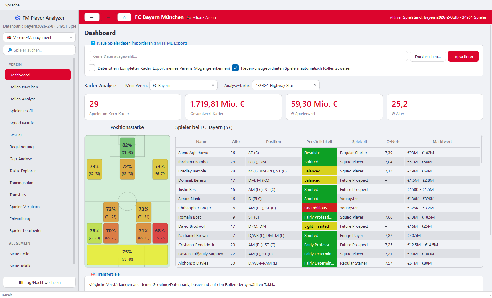

<div align="center">

# ⚽ FM Player Analyzer

### Schluss mit Raten, wer spielen soll.

Das kostenlose Desktop-Tool für den **Football Manager 2024**, das aus deinen
Kader- und Scouting-Exporten klare Antworten macht: deine echte Best XI, die
versteckte Schwachstelle im Team, das Talent, das sich lohnt, und die Taktik,
für die dein Kader gebaut ist.

[](https://github.com/ElectroHugin/FM-Player-Analyzer/releases/latest)

[](https://github.com/ElectroHugin/FM-Player-Analyzer/releases/latest)
[](https://github.com/ElectroHugin/FM-Player-Analyzer/releases)
[](LICENSE)


[🇬🇧 English](README.md) · **🇩🇪 Deutsch**

[Warum du es willst](#-warum-du-es-willst) ·
[Die Funktionen](#-die-funktionen) ·
[In 5 Minuten startklar](#-in-5-minuten-startklar) ·
[So funktioniert die Bewertung](#-so-funktioniert-die-bewertung-dwrs) ·
[FAQ](#-faq)



</div>

---

## 🔥 Warum du es willst

Du kennst das. 60 Spieler im Kader, 8.000 auf der Scouting-Liste, und die
Sterne im FM sagen dir, dass die Hälfte davon „3½ Sterne" hat. Wer ist
*wirklich* dein bester inverser Außenverteidiger? Verdient der 17-Jährige einen
Platz im Profikader? Hast du gerade 60 Millionen für die falsche Position
ausgegeben?

Der FM Player Analyzer beantwortet das mit **einer ehrlichen Zahl pro Spieler
und Rolle** und baut alles Weitere darauf auf.

| Du fragst | Die App antwortet |
|---|---|
| *„Wer ist mein bester Spieler für genau diese Rolle?"* | Ein Rollen-Score von 0–100 (**DWRS**) für jeden Spieler in jeder Rolle: farbcodiert, sortierbar, über Positionen hinweg vergleichbar. |
| *„Was ist meine stärkste Elf?"* | Eine Best XI auf dem Taktik-Spielfeld, dazu B-Team, Jugend und Zweitteam, je Wettbewerb. |
| *„Wo ist mein Team wirklich schwach?"* | Eine Gap-Analyse, die offensichtliche Lücken findet *und* versteckte, etwa einen Star, der nicht auf seiner besten Position spielt. |
| *„Welche Taktik passt zu diesem Kader?"* | Jede mitgelieferte Taktik, sortiert danach, wie gut deine Spieler sie ausfüllen. Ideal, wenn du einen neuen Verein übernimmst. |
| *„Wen soll ich holen?"* | Deine ganze Scouting-Datenbank, gerankt für die Rolle, die du brauchst, mit Filtern für Alter, Marktwert, Nationalität und Persönlichkeit. |
| *„Wird aus dem Jungen ein Star?"* | Ein Talent-Score aus aktueller Stärke, verbleibenden Entwicklungsjahren, Mentalität und Persönlichkeit. |
| *„Was soll er trainieren?"* | Die Trainingsmethoden, die seinen Rollen-Score am meisten heben, in der richtigen Reihenfolge. |
| *„Wen melde ich?"* | Ein Meldelisten-Assistent für die Quoten der Premier League und der Champions / Europa / Conference League. |

**Und sie respektiert deine Zeit und deinen Spielstand:**

- 🆓 **Kostenlos und Open Source.** Keine Werbung, kein Konto, kein Abo.
- 🔌 **Komplett offline.** Die App verbindet sich nie mit dem Internet. Deine Daten bleiben auf deinem PC.
- 🛡️ **Dein Spielstand wird nie angefasst.** Die App liest nur die HTML-Dateien, die du selbst aus dem FM exportierst.
- ⚡ **Schnell.** Eine native Windows-App für riesige Datenbanken: Ein Scouting-Export mit 11.000 Spielern ist in wenigen Sekunden importiert und bewertet, und auch mit über 80.000 Spielern bleibt alles flüssig.
- 🎯 **Kein Cheaten.** Die App sieht genau das, was du im Spiel siehst. Ungescoutete Attributbereiche wie `12–15` bleiben Bereiche.

---

## 🎬 Die Funktionen

### 🏆 Deine echte Best XI — das Herzstück der App

Nicht die elf höchsten Zahlen, sondern die elf, die zusammen das stärkste *Team*
ergeben. Startelf und B-Team stehen nebeneinander auf dem Spielfeld in deiner
Formation, jeder Spieler mit Bewertung, Rolle und vereinbarter Spielzeit.
Doppelklick auf einen Spieler öffnet sein Profil, Rechtsklick alles Weitere.



**Warum sie besser aufstellt als „bester Spieler pro Position".** Die meisten
Tools gehen die Formation Position für Position durch und geben jeder ihren
besten Spieler. Das geht schief, sobald ein Spieler für zwei Positionen die
beste Wahl ist: Die Position, die zuerst dran ist, bekommt ihn, die andere den
Rest. Diese App entscheidet die schwierigste Frage zuerst:

1. **Kandidaten für jede Position reihen.** Berücksichtigt wird nur, wer dort
   wirklich spielen kann, sortiert nach seiner Bewertung für die Rolle dieser
   Position. Vereinbarte Spielzeit und natürliche Positionen kannst du
   mitgewichten, und einen Spieler auf eine Hauptrolle festlegen.
2. **Die Position mit dem größten Leistungsabfall finden.** Für jede offene
   Position vergleicht die App ihren besten Kandidaten mit dem zweitbesten. Wo
   dieser Abstand am größten ist, ist der Beste am schwersten zu ersetzen, also
   wird diese Position zuerst besetzt.
3. **Wiederholen.** Der gewählte Spieler verschwindet aus allen anderen
   Kandidatenlisten, die Abstände werden neu berechnet, und die nächste
   kritische Position wird entschieden, bis alle elf besetzt sind.
4. **Feinschliff.** Zwei Spieler mit derselben Rolle auf gespiegelten
   Positionen, etwa zwei Innenverteidiger, tauschen die Seite, wenn sie damit
   auf ihrer bevorzugten Seite stehen.

Das B-Team entsteht danach auf dieselbe Weise aus allen übrigen Spielern, dann
folgen die besten Tiefen-Optionen je Rolle, eine Jugend-XI und eine
Zweitteam-XI. Wechsle oben den Wettbewerb, und alles wird aus den Spielern neu
gebaut, die dafür wirklich gemeldet sind.

### Nach Rolle scouten, nicht nach Ruf

Wähle eine Rolle und sieh deinen Kader und deine komplette Scouting-Liste dafür
gerankt, hier 8.542 gescoutete Spieler als Advanced Forward. Filtere mit einem
Klick nach Persönlichkeit und lies Stärken und Schwächen jedes Spielers *für
genau diese Rolle*.



### Alles über einen Spieler auf einer Seite

Die fünf besten Rollen, Talent-Projektion, eine persönliche Trainingsempfehlung,
Stärken und Schwächen, Schlüsselattribute und der Bewertungsverlauf. Per
Rechtsklick auf jeden Spieler irgendwo in der App öffnest du sein Profil,
vergleichst ihn, bearbeitest ihn oder setzt ihn auf Transfer-, Leih- oder
Shortlist.



### Direkter Vergleich

Bis zu fünf Spieler nebeneinander: Radar-Diagramme für Spielbereiche und für
die Attribute, die am meisten zählen, dazu eine farbcodierte Attribut-Tabelle.
Klärt die Frage „Wer spielt am Samstag?" in Sekunden.



### Finde die Taktik, für die dein Kader gebaut ist

Der Taktik-Explorer bewertet deinen Kader gegen alle Taktiken auf einmal: erst
die Abdeckung (kannst du alle elf Positionen besetzen?), dann die Stärke je
Mannschaftsteil. Ein Klick auf eine Taktik zeigt, wie viele passende Spieler du
für jeden Slot hast. Die mitgelieferten Taktiken sind aus der
[FM-Arena FM24 Hall of Fame](https://fm-arena.com/table/fm24-hall-of-fame/)
nachgebaut, eigene kannst du ergänzen.



### Ein Trainingsplan, der rechnet

Für jeden Spieler ermittelt die App, welche Trainingsmethoden seinen
Rollen-Score am meisten heben, und berücksichtigt dabei sein Alter: Tempo
trainiert man mit 19, nicht mit 29. Eine Tabelle für die erste Mannschaft, eine
für das Zweitteam.



### Nie wieder einen Meldeplatz verschenken

An den Home-Grown-Quoten lassen gute Kader Punkte liegen. Der Assistent schlägt
eine Meldeliste vor, die regelkonform *und* voll ist: 25 Plätze,
Nicht-Home-Grown-Grenze, Club-Grown-Plätze, Mindestzahl Torhüter, U21 und
Liste B. Freie Home-Grown-Plätze füllt er mit deinen besten jungen Spielern,
statt sie leer zu lassen, und er zeigt, was die Regeln deine Startelf kosten.
Hake an, wen du wirklich gemeldet hast, speichere, und Best XI rechnet mit
dieser Liste.



### Sieh deinem Kader beim Wachsen zu

Jeder Import ist eine Momentaufnahme. Exportiere während der Saison erneut und
verfolge, wie sich dein Kader, eine einzelne Rolle oder ein Spieler entwickelt.



### Mach es zu deinem

Dunkel- und Hellmodus, 37 Vereins-Farbschemata von Bayern bis Celtic, eigene
Farben und das Logo deines Vereins in der Kopfzeile.



### Und es gibt noch mehr

- **Nationalmannschafts-Modus** — eigenes Dashboard, Kader-Auswahl, Matrix und Best XI, dazu ein Nominierungs-Assistent, der sagt, wen du einladen und wen du streichen solltest.
- **Squad Matrix** — jeder Spieler gegen jede Rolle einer Taktik in einer farbcodierten Tabelle, mit Talent-Filter, Free-Agent-Suche und CSV-Export.
- **Gap-Analyse** — markiert Positionen, die gegenüber dem Team abfallen, und Spieler, die von ihrer besten Position weggezogen sind oder auf der falschen Seite spielen.
- **Transfers und Leihen** — schlägt vielversprechende Talente zum Verleihen und überzählige Spieler zum Verkauf vor.
- **Eigene Rollen und Taktiken** — eingebaute Editoren; Neues ist sofort überall verfügbar.
- **Kluger Import** — Newgens behalten über Exporte hinweg ihre Identität, Abgänge werden erkannt, und neue Spieler bekommen ihre Rollen automatisch.
- **Kleinigkeiten, die zählen** — globale Spielersuche, die „Müller" auch bei „muller" findet, Vor-/Zurück-Navigation, Oberfläche auf Englisch und Deutsch.

---

## 🚀 In 5 Minuten startklar

**1 · App installieren**

Lade die neueste `FMPlayerAnalyzer-…-Windows-x64-Setup.exe` von der
[Releases-Seite](https://github.com/ElectroHugin/FM-Player-Analyzer/releases/latest)
und führe sie aus. Mehr brauchst du nicht. Der Installer ist nicht signiert,
deshalb zeigt Windows eventuell einen SmartScreen-Hinweis: *Weitere
Informationen → Trotzdem ausführen*.

**2 · Export-Ansicht in den FM holen**

Die App liest den normalen HTML-Export des Football Manager. Am einfachsten
geht es mit den fertigen Ansichten von **PlayingSquirrel**
([@playingsquirrel](https://x.com/playingsquirrel)):
[hier die FM24-Ansichtsdateien herunterladen](https://www.mediafire.com/file/ymf6xhw0bk4enjj/FM24_files.zip/file)
und im FM importieren. Achte darauf, dass die Ansicht die Spalte **UID**
enthält.

**3 · Spieler exportieren**

Öffne im FM deinen Kader (und später jede Scouting- oder Spielersuch-Liste) mit
dieser Ansicht, dann *Rechtsklick → Drucken/Exportieren → Webseite (.html)*.

**4 · Importieren**

Öffne den FM Player Analyzer, geh auf **Dashboard → Neue Spielerdaten
importieren**, wähle die Datei und klicke auf **Importieren**. Rollen werden
zugewiesen und alle Bewertungen automatisch berechnet.

**5 · Der App sagen, wer du bist**

Wähle auf dem Dashboard **Mein Verein**. Unter **Einstellungen → Verein**
kannst du ein Zweitteam, deine Lieblings-Taktiken und, falls deine Liga eine
Meldeliste verlangt, die Registrierungsregeln eintragen.

**6 · Loslegen**

Fang mit **Best XI** an, schau dann in die **Gap-Analyse** und den
**Taktik-Explorer**. Importiere einen großen Scouting-Export und öffne die
**Rollen-Analyse**, um zu sehen, wen du wirklich kaufen solltest.

> **Tipps**
> - Importiere neu, so oft du willst; einmal pro Spielmonat ist ein guter Rhythmus. Die App aktualisiert bekannte Spieler und baut ihren Bewertungsverlauf auf.
> - Wenn du deinen kompletten Kader importierst, hake *„Datei ist ein kompletter Kader-Export meines Vereins"* an. Die App fragt dann, was aus den fehlenden Spielern geworden ist.
> - Aktiviere für Newgens im FM die Option *„UIDs verwenden"*, damit Spieler über Exporte hinweg eine feste ID behalten.
> - Die Oberfläche ist standardmäßig englisch; Deutsch gibt es im Menü **Language**.

---

## 🧠 So funktioniert die Bewertung (DWRS)

**DWRS**, der *Dynamic Weighted Role Score*, ist eine Zahl von 0 bis 100, die
sagt, wie gut ein Spieler zu einer bestimmten Rolle passt. Keine Blackbox: Jedes
Gewicht ist sichtbar und einstellbar.

1. **Nicht alle Attribute sind gleich wichtig.** Angelehnt an Community-Recherche
   (vor allem
   [u/florin133s Meta-Attribut-Guide](https://www.reddit.com/r/footballmanagergames/comments/16fuksi/a_not_so_short_guide_to_meta_player_attributes/))
   sind die Attribute in Wichtigkeits-Stufen eingeteilt. Pace und Acceleration
   wiegen weit mehr als Teamwork.
2. **Die Rolle bestimmt, was zählt.** Attribute, die für die Rolle *Schlüssel*
   sind, zählen ×1,5, *bevorzugte* ×1,2. Passing und Vision sind bei einem
   Ball-Playing Defender wichtiger, Crossing und Dribbling bei einem Winger.
3. **Normalisiert auf 0–100 %.** 0 % ist ein Spieler mit überall 1, 100 % einer
   mit 20 in allem, was für die Rolle zählt. So sind Scores über Rollen und
   Positionen hinweg vergleichbar.

<details>
<summary><b>Die vollständige Formel und die Standardgewichte</b></summary>

<br>

| Stufe | Standardgewicht | Beispiele |
|---|---|---|
| Extremely Important | 8,0 | Pace, Acceleration |
| Important | 4,0 | Jumping Reach, Anticipation, Balance, Agility, Concentration, Finishing |
| Good | 2,0 | Work Rate, Dribbling, Stamina, Strength, Passing, Determination, Vision |
| Decent | 1,0 | Long Shots, Marking, Decisions, First Touch |
| Almost Irrelevant | 0,2 | Off the Ball, Tackling, Teamwork, Composure, Technique, Positioning |

Für die bewertete Rolle wird jedes Attribut mit seinem Rollenfaktor
multipliziert (Schlüssel ×1,5, bevorzugt ×1,2, sonst ×1). Innerhalb jeder Stufe
mittelt die App diese Werte und multipliziert mit dem Stufengewicht; die Summe
über alle Stufen ist der „absolute" Score. Er wird dann zwischen derselben
Rechnung für einen Spieler mit 1 in jedem Attribut (0 %) und einen mit 20 in
jedem Attribut (100 %) skaliert.

Torhüter haben eigene Stufen und Gewichte. Die Stufengewichte, die
Multiplikatoren und die Schlüssel- bzw. bevorzugten Attribute jeder Rolle
lassen sich unter **Einstellungen** ändern. Passe sie an deine Spielidee an,
und jede Bewertung aktualisiert sich.

</details>

---

## ❓ FAQ

**Ist das wirklich kostenlos?**
Ja. Open Source unter GPLv3, keine Werbung, keine Bezahlversion.

**Kann die App meinen Spielstand beschädigen?**
Nein. Die App öffnet deinen Spielstand nie. Sie liest die HTML-Dateien, die du
aus dem Spiel exportierst, und führt ihre eigene Datenbank unter
`%LOCALAPPDATA%\FM24PlayerAnalyzer`. Updates und Deinstallation lassen diesen
Ordner unangetastet.

**Ist das Cheaten?**
Die App nutzt nur, was dir das Spiel zeigt. Attribute von nicht vollständig
gescouteten Spielern bleiben verdeckte Bereiche, genau wie exportiert.

**Welche Football-Manager-Versionen werden unterstützt?**
Football Manager 2024. Das Import-Format ist pro Spielversion definiert, weitere
Versionen lassen sich also ergänzen.

**Mac oder Linux?**
Vorerst nur Windows 10 / 11 (64-bit).

**Meine Liga steht nicht bei den Registrierungsregeln.**
Wähle *Standard (keine Beschränkung)*. Hinterlegt sind bisher die Premier League
und die UEFA-Vereinswettbewerbe; die UEFA-Liste funktioniert mit jeder Liga.

**Ich habe die ältere Streamlit-Version benutzt.**
Ein einmaliger Migrations-Assistent (Einstellungen → Datenbank →
*Legacy-Datenbank importieren*) übernimmt deine alten Datenbanken und
Einstellungen.

---

<details>
<summary><b>📋 Export-Spalten, die die App versteht (Football Manager 2024)</b></summary>

<br>

Zwingend sind nur **UID** und **Name**. Jede weitere Spalte verbessert die
Bewertungen; ein fehlendes Attribut gilt einfach als unbekannt.

- **Identität & Info:** `UID`, `Name`, `Age`, `Nat`, `2nd Nat`, `Club`,
  `Position`, `Personality`, `Media Handling`, `Preferred Foot`, `Left Foot`,
  `Right Foot`, `Height`, `Wage`, `Transfer Value`, `Av Rat`,
  `Agreed Playing Time`
- **Technisch:** `Cor`, `Cro`, `Dri`, `Fin`, `Fir`, `Hea`, `Lon`, `Mar`,
  `Pas`, `Tck`, `Tec`
- **Mental:** `Agg`, `Ant`, `Bra`, `Cmp`, `Cnt`, `Dec`, `Det`, `Fla`, `Ldr`,
  `OtB`, `Pos`, `Tea`, `Vis`, `Wor`
- **Physisch:** `Acc`, `Agi`, `Bal`, `Jum`, `Pac`, `Sta`, `Str`
- **Torwart:** `1v1`, `Aer`, `Cmd`, `Han`, `Kic`, `Ref`, `TRO`, `Thr`

Die Zuordnung steht in
[`desktop/src/core/Constants.cpp`](desktop/src/core/Constants.cpp)
(`fm24AttributeMapping`).

</details>

<details>
<summary><b>🛠️ Für Entwickler: Repository-Aufbau und Bauen aus dem Quellcode</b></summary>

<br>

| Verzeichnis | Implementierung | Status |
|---|---|---|
| [`desktop/`](desktop/) | **C++ 20 / Qt 6 Widgets** — die native Windows-App | Aktiv |
| [`legacy/`](legacy/) | **Python / Streamlit** — die ursprüngliche Web-Version | Als Verhaltens-Referenz erhalten |

Voraussetzungen: Visual Studio 2022 (C++, x64), CMake ≥ 3.28, Ninja und
Qt 6.8 LTS mit dem Qt-Charts-Add-on.

```powershell
cd desktop
.\scripts\build.ps1 -Preset msvc-release -Test   # bauen + Tests ausführen
.\scripts\package.ps1                             # windeployqt + Installer
```

Details in [`desktop/README.md`](desktop/README.md). Ideen und technischer
Backlog stehen in [`desktop/IDEEN.md`](desktop/IDEEN.md) und
[`desktop/BACKLOG.md`](desktop/BACKLOG.md).

</details>

---

## 🙏 Auf den Schultern der FM-Community

- Die Meta-Attribut-Gewichtung wurde von der Recherche von
  **[u/florin133](https://www.reddit.com/r/footballmanagergames/comments/16fuksi/a_not_so_short_guide_to_meta_player_attributes/)**
  inspiriert.
- Die Export-Ansichten stammen von
  **[PlayingSquirrel](https://x.com/playingsquirrel)**.
- Die mitgelieferten Taktiken sind aus der
  **[FM-Arena FM24 Hall of Fame](https://fm-arena.com/table/fm24-hall-of-fame/)**
  nachgebaut. Voller Dank an ihre Autoren und das FM-Arena-Team.
- Frühe Ideen für die Datenansichten kamen von der
  **[FM Client App](https://fm-client-app.vercel.app/)**.

Fehler gefunden oder eine Idee?
[Öffne ein Issue](https://github.com/ElectroHugin/FM-Player-Analyzer/issues).
Und wenn die App deinem Spielstand hilft: Ein ⭐ auf GitHub hilft anderen, sie
zu finden.

## Lizenz & Haftungsausschluss

Lizenziert unter **GPLv3**, siehe [LICENSE](LICENSE).

Dies ist ein inoffizielles, von Fans erstelltes Tool und wird von Sports
Interactive oder SEGA weder unterstützt noch ist es mit ihnen verbunden.
*Football Manager*, das Football-Manager-Logo und Sports Interactive sind
Marken von Sports Interactive Limited; SEGA und das SEGA-Logo sind Marken der
SEGA Corporation. Alle spielinternen Daten sind Eigentum von Sports Interactive
und/oder SEGA. Die Screenshots zeigen einen fiktiven Spielstand. Die Software
wird „wie besehen" bereitgestellt, ohne Gewährleistung jeglicher Art.
