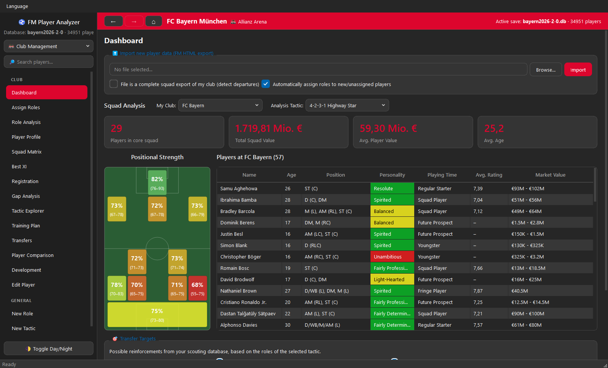
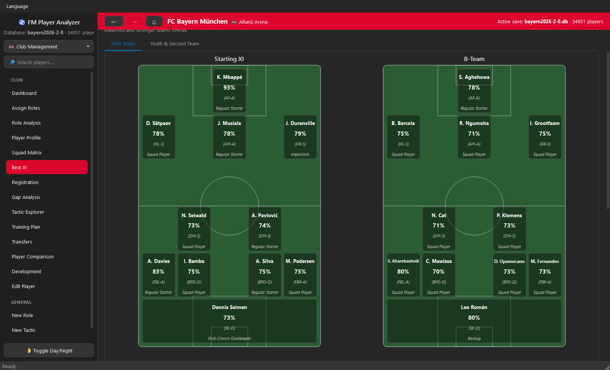
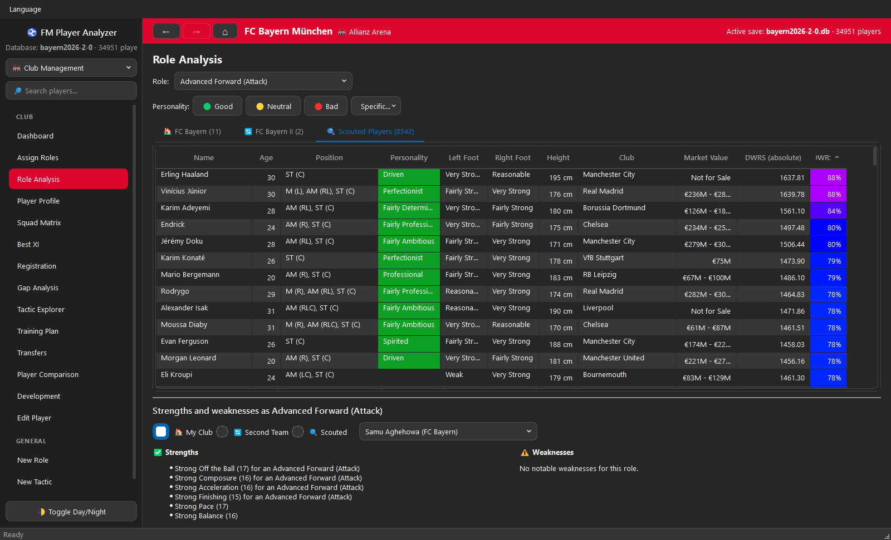
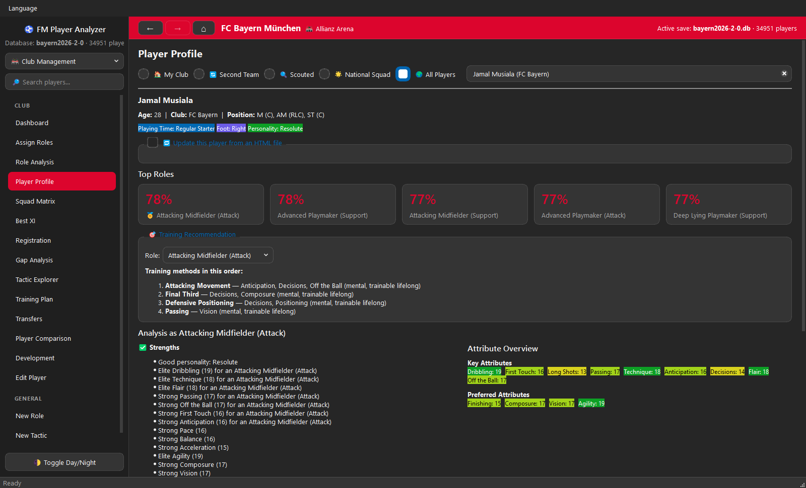
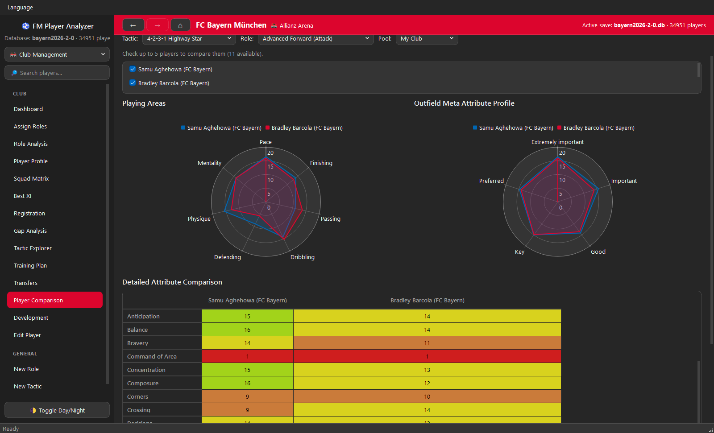
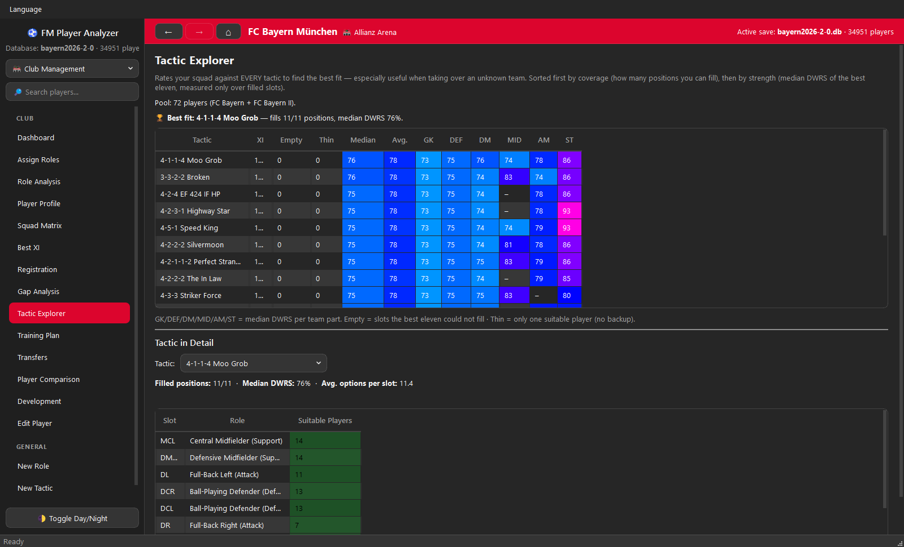
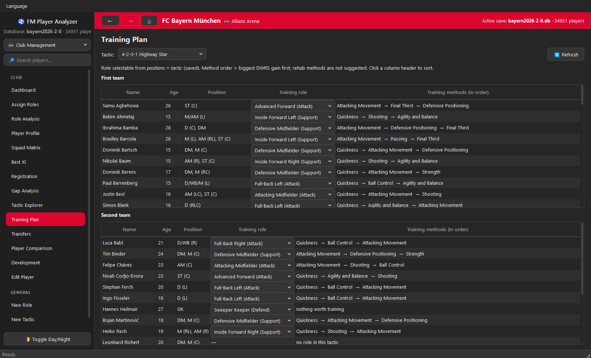
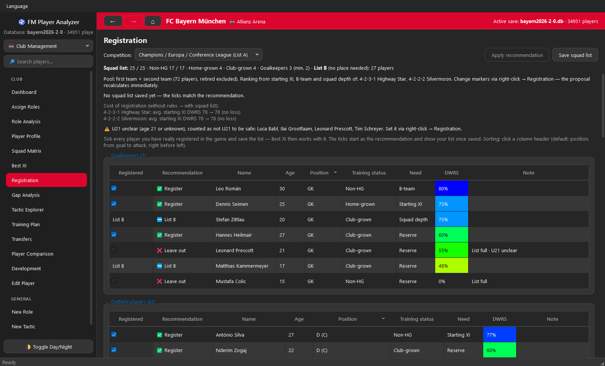
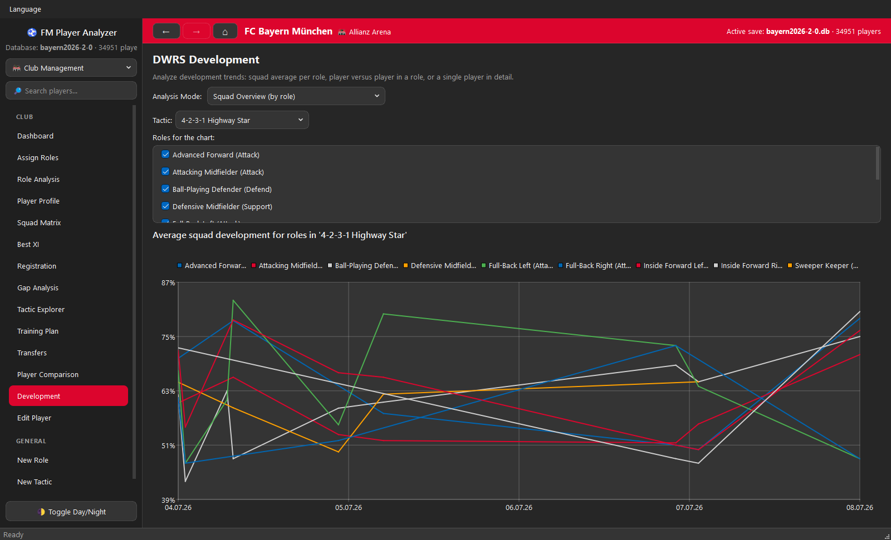
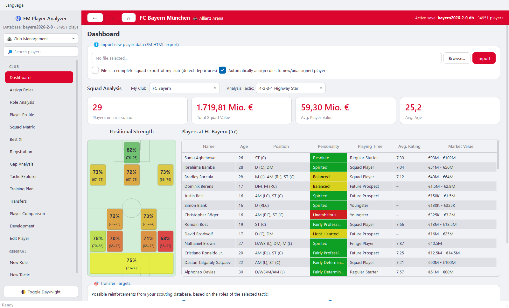

<div align="center">

# ⚽ FM Player Analyzer

### Stop guessing who should play. Know it.

The free desktop companion for **Football Manager 2024** that turns your squad
and scouting exports into clear answers: your real Best XI, the hidden weak
spot in your team, the wonderkid worth signing and the tactic your squad was
built for.

[](https://github.com/ElectroHugin/FM-Player-Analyzer/releases/latest)

[](https://github.com/ElectroHugin/FM-Player-Analyzer/releases/latest)
[](https://github.com/ElectroHugin/FM-Player-Analyzer/releases)
[](LICENSE)


**🇬🇧 English** · [🇩🇪 Deutsch](README.de.md)

[Why you'll want it](#-why-youll-want-it) ·
[Feature tour](#-feature-tour) ·
[Get started in 5 minutes](#-get-started-in-5-minutes) ·
[How the rating works](#-how-the-rating-works-dwrs) ·
[FAQ](#-faq)



</div>

---

## 🔥 Why you'll want it

You know the feeling. 60 players in the squad, 8,000 on the scouting list, and
FM's star ratings tell you that half of them are "3½ stars". Who is *actually*
your best Inverted Wing-Back? Is the 17-year-old worth a first-team place? Did
you just spend €60M on the wrong position?

FM Player Analyzer answers that with **one honest number per player and role**
and builds everything else on top of it.

| You ask | The app answers |
|---|---|
| *"Who is my best player for this exact role?"* | A 0–100 role-fit score (**DWRS**) for every player in every role, colour-coded, sortable, comparable across positions. |
| *"What is my strongest eleven?"* | A Best XI on a tactical pitch — plus B-team, youth and second team, per competition. |
| *"Where is my team really weak?"* | Gap analysis that finds the obvious holes *and* the hidden ones, such as a star playing out of his best slot. |
| *"Which tactic suits this squad?"* | Every bundled tactic ranked by how well your players fill it. Ideal when you take over a new club. |
| *"Who should I sign?"* | Your whole scouting database ranked for the role you need, with filters for age, value, nationality and personality. |
| *"Is this kid a future star?"* | A talent score that combines current ability, years left to develop, mentality and personality. |
| *"What should he train?"* | The training methods that raise his rating for his role the most, in order. |
| *"Who do I register?"* | A squad-list assistant for the Premier League and the Champions / Europa / Conference League quotas. |

**And it respects your time and your save:**

- 🆓 **Free and open source.** No ads, no account, no subscription.
- 🔌 **Fully offline.** The app never connects to the internet. Your data stays on your PC.
- 🛡️ **Your save game is never touched.** It only reads the HTML files you export from FM yourself.
- ⚡ **Fast.** A native Windows app built for huge databases — an 11,000-player scouting export is imported and rated in a few seconds, and it stays smooth with 80,000+ players.
- 🎯 **No cheating.** It sees exactly what you see in the game. Unscouted attribute ranges like `12–15` stay ranges.

---

## 🎬 Feature tour

### 🏆 Your real Best XI — the heart of the app

Not the eleven highest numbers, but the eleven that make the strongest *team*.
Starting XI and B-team stand side by side on the pitch in your formation, every
player with his rating, his role and his agreed playing time. Double-click a
player for his profile, right-click for everything else.



**Why it picks better than "best player per position".** Most tools walk
through the formation slot by slot and hand each one its best player. That
breaks as soon as a player is the best option for two positions: whichever slot
comes first gets him, the other one is left with the scraps. This app decides
the hardest question first:

1. **Rank the candidates for every slot.** Only players who can really play
   there are considered, scored by their rating for that slot's role. You can
   let agreed playing time and natural positions weigh in, and pin a player to
   a primary role.
2. **Find the slot with the biggest drop-off.** For every open slot the app
   compares its best candidate with the next-best one. Where that gap is
   largest, the best player is the hardest to replace — so that slot is filled
   first.
3. **Repeat.** The chosen player leaves every other slot's list, the gaps are
   recalculated, and the next most critical slot is decided, until all eleven
   are filled.
4. **Finishing touches.** Two players sharing a role on mirrored slots — two
   centre-backs, say — are swapped if that puts them on their preferred side.

The B-team is then built the same way from everyone who is left, followed by
the best depth options per role, a youth XI and a second-team XI. Switch the
competition at the top and the whole thing is rebuilt from the players who are
actually registered for it.

### Scout by role, not by reputation

Pick a role and get your own squad and your entire scouting list ranked for it —
here 8,542 scouted players as Advanced Forward. Filter by personality with one
click, then read each player's strengths and weaknesses *for that role* in plain
language.



### Everything about one player on one page

Top five roles, talent projection, a personal training recommendation,
strengths and weaknesses, key attributes and the rating history. Right-click any
player anywhere in the app to open his profile, compare him, edit him or put
him on the transfer, loan or shortlist.



### Head-to-head comparison

Up to five players side by side: radar charts for playing areas and for the
attributes that matter most, plus a colour-coded attribute table. Settles the
"who starts on Saturday" debate in seconds.



### Find the tactic your squad was built for

The Tactic Explorer rates your squad against every tactic at once — coverage
first (can you fill all eleven positions?), then strength per line. Click a
tactic to see how many suitable players you have for each slot. The bundled
tactics are rebuilt from the
[FM-Arena FM24 Hall of Fame](https://fm-arena.com/table/fm24-hall-of-fame/), and
you can add your own.



### A training plan that follows the maths

For every player the app works out which training methods raise his rating for
his role the most — and takes his age into account, because pace is trained at
19, not at 29. One table for the first team, one for the second team.



### Never waste a registration slot again

Home-grown quotas are where good squads lose points. The assistant proposes a
squad list that is legal *and* full: 25 places, non-home-grown limit,
club-trained places, minimum goalkeepers, U21 and list B. It fills free
home-grown places with your best young players instead of leaving them empty,
and shows what the rules cost your starting eleven. Tick who you really
registered, save, and Best XI works with that list.



### Watch your squad grow

Every import is a snapshot. Re-export during the season and follow how your
squad, a single role or one player develops over time.



### Make it yours

Dark and light mode, 37 club colour presets from Bayern to Celtic, your own
colours and your club's logo in the header.



### And there is more

- **National-team mode** — its own dashboard, squad selection, matrix and Best XI, plus a call-up assistant that tells you who to invite and who to drop.
- **Squad Matrix** — every player against every role of a tactic in one colour-coded table, with a talent filter, free-agent search and CSV export.
- **Gap analysis** — flags slots that drop off against the team and players pulled away from their best position or onto the wrong side.
- **Transfers and loans** — suggests promising talents to loan out and surplus players to sell.
- **Your own roles and tactics** — built-in editors; new entries are available everywhere immediately.
- **Smart imports** — newgens keep their identity across exports, departures are detected, and new players get their roles assigned automatically.
- **Small things that matter** — global player search that finds "Müller" when you type "muller", back/forward navigation, English and German interface.

---

## 🚀 Get started in 5 minutes

**1 · Install the app**

Download the latest `FMPlayerAnalyzer-…-Windows-x64-Setup.exe` from the
[Releases page](https://github.com/ElectroHugin/FM-Player-Analyzer/releases/latest)
and run it. Nothing else is needed. The installer is not code-signed, so Windows
may show a SmartScreen notice — choose *More info → Run anyway*.

**2 · Get the export view into FM**

The app reads the standard HTML export of Football Manager. The easiest way is
the ready-made custom views by **PlayingSquirrel**
([@playingsquirrel](https://x.com/playingsquirrel)) —
[download the FM24 view files here](https://www.mediafire.com/file/ymf6xhw0bk4enjj/FM24_files.zip/file)
and import them in FM. Make sure the view contains the **UID** column.

**3 · Export your players**

In FM, open your squad (and later any scouting or player-search list) with that
view, then *right-click → Print/Export → Web page (.html)*.

**4 · Import**

Open FM Player Analyzer, go to **Dashboard → Import new player data**, choose
the file and click **Import**. Roles are assigned and all ratings calculated
automatically.

**5 · Tell the app who you are**

Pick **My Club** on the dashboard. Under **Settings → Club** you can add a
second team, your favourite tactics and — if you play in a league with squad
registration — the registration rules.

**6 · Explore**

Start with **Best XI**, then look at **Gap Analysis** and the **Tactic
Explorer**. Import a big scouting export and open **Role Analysis** to see who
you should really be buying.

> **Tips**
> - Re-import whenever you like — once a month in game time is a good rhythm. The app updates known players and builds their rating history.
> - When you import your complete squad, tick *"File is a complete squad export of my club"* and the app asks what happened to the players who are gone.
> - For newgens, enable FM's *"Use UIDs"* option so players keep a stable ID across exports.
> - The interface is English by default; German is available in the **Language** menu.

---

## 🧠 How the rating works (DWRS)

**DWRS** — the *Dynamic Weighted Role Score* — is one number from 0 to 100 that
says how well a player fits a specific role. No black box: every weight is
visible and adjustable.

1. **Not all attributes are equal.** Following community research (notably
   [u/florin133's meta-attribute guide](https://www.reddit.com/r/footballmanagergames/comments/16fuksi/a_not_so_short_guide_to_meta_player_attributes/)),
   attributes are grouped into importance tiers. Pace and Acceleration weigh
   far more than Teamwork.
2. **The role decides what counts.** Attributes that are *key* for the role are
   boosted ×1.5, *preferred* ones ×1.2 — Passing and Vision matter more for a
   Ball-Playing Defender, Crossing and Dribbling for a Winger.
3. **Normalised to 0–100 %.** 0 % is a player with 1 everywhere, 100 % a player
   with 20 in everything that matters for the role. That makes scores
   comparable across roles and positions.

<details>
<summary><b>The full formula and the default weights</b></summary>

<br>

| Tier | Default weight | Examples |
|---|---|---|
| Extremely Important | 8.0 | Pace, Acceleration |
| Important | 4.0 | Jumping Reach, Anticipation, Balance, Agility, Concentration, Finishing |
| Good | 2.0 | Work Rate, Dribbling, Stamina, Strength, Passing, Determination, Vision |
| Decent | 1.0 | Long Shots, Marking, Decisions, First Touch |
| Almost Irrelevant | 0.2 | Off the Ball, Tackling, Teamwork, Composure, Technique, Positioning |

For the role being scored, every attribute is multiplied by its role factor
(key ×1.5, preferred ×1.2, otherwise ×1). Within each tier the app averages
these values and multiplies by the tier weight; the sum over all tiers is the
"absolute" score. It is then scaled between the same calculation for a player
with 1 in every attribute (0 %) and one with 20 in every attribute (100 %).

Goalkeepers have their own tiers and weights. The tier weights, the multipliers
and the key/preferred attributes of every role can be changed under
**Settings** — tune them to your philosophy and every rating updates.

</details>

---

## ❓ FAQ

**Is it really free?**
Yes. Open source under GPLv3, no ads, no paid tier.

**Can it damage my save game?**
No. The app never opens your save. It reads the HTML files you export from the
game and keeps its own database in `%LOCALAPPDATA%\FM24PlayerAnalyzer`.
Updating or uninstalling the app leaves that folder alone.

**Is this cheating?**
It uses only what the game shows you. Attributes of players you have not fully
scouted stay masked ranges, exactly as exported.

**Which Football Manager versions are supported?**
Football Manager 2024. The import layout is defined per game version, so other
versions can be added.

**Mac or Linux?**
Windows 10 / 11 (64-bit) only for now.

**I play in a league that is not listed in the registration rules.**
Choose *Default (no restriction)*. Premier League and the UEFA club competitions
are modelled today; the UEFA list works with any league.

**I used the older Streamlit version.**
A one-time migration wizard (Settings → Database → *Import legacy database*)
converts your old databases and settings.

---

<details>
<summary><b>📋 Export columns the app understands (Football Manager 2024)</b></summary>

<br>

Only **UID** and **Name** are required. Every other column improves the
ratings; a missing attribute is simply treated as unknown.

- **Identity & info:** `UID`, `Name`, `Age`, `Nat`, `2nd Nat`, `Club`,
  `Position`, `Personality`, `Media Handling`, `Preferred Foot`, `Left Foot`,
  `Right Foot`, `Height`, `Wage`, `Transfer Value`, `Av Rat`,
  `Agreed Playing Time`
- **Technical:** `Cor`, `Cro`, `Dri`, `Fin`, `Fir`, `Hea`, `Lon`, `Mar`,
  `Pas`, `Tck`, `Tec`
- **Mental:** `Agg`, `Ant`, `Bra`, `Cmp`, `Cnt`, `Dec`, `Det`, `Fla`, `Ldr`,
  `OtB`, `Pos`, `Tea`, `Vis`, `Wor`
- **Physical:** `Acc`, `Agi`, `Bal`, `Jum`, `Pac`, `Sta`, `Str`
- **Goalkeeping:** `1v1`, `Aer`, `Cmd`, `Han`, `Kic`, `Ref`, `TRO`, `Thr`

The mapping lives in
[`desktop/src/core/Constants.cpp`](desktop/src/core/Constants.cpp)
(`fm24AttributeMapping`).

</details>

<details>
<summary><b>🛠️ For developers: repository layout and building from source</b></summary>

<br>

| Directory | Implementation | Status |
|---|---|---|
| [`desktop/`](desktop/) | **C++ 20 / Qt 6 Widgets** — the native Windows app | Active |
| [`legacy/`](legacy/) | **Python / Streamlit** — the original web-UI version | Kept as behavioural reference |

Requirements: Visual Studio 2022 (C++, x64), CMake ≥ 3.28, Ninja and Qt 6.8 LTS
with the Qt Charts add-on.

```powershell
cd desktop
.\scripts\build.ps1 -Preset msvc-release -Test   # build + run tests
.\scripts\package.ps1                             # windeployqt + installer
```

See [`desktop/README.md`](desktop/README.md) for details. Ideas and the
technical backlog live in [`desktop/IDEEN.md`](desktop/IDEEN.md) and
[`desktop/BACKLOG.md`](desktop/BACKLOG.md) (German).

</details>

---

## 🙏 Standing on the shoulders of the FM community

- The meta-attribute weighting was inspired by the research of
  **[u/florin133](https://www.reddit.com/r/footballmanagergames/comments/16fuksi/a_not_so_short_guide_to_meta_player_attributes/)**.
- The custom export views are the work of
  **[PlayingSquirrel](https://x.com/playingsquirrel)**.
- The bundled tactics are replicated from the
  **[FM-Arena FM24 Hall of Fame](https://fm-arena.com/table/fm24-hall-of-fame/)** —
  full credit to their authors and the FM-Arena team.
- Early data-view ideas were inspired by the
  **[FM Client App](https://fm-client-app.vercel.app/)**.

Found a bug or have an idea?
[Open an issue](https://github.com/ElectroHugin/FM-Player-Analyzer/issues) — and
if the app helps your save, a ⭐ on GitHub helps others find it.

## License & disclaimer

Licensed under **GPLv3** — see [LICENSE](LICENSE).

This is an unofficial, fan-made tool and is not endorsed by or affiliated with
Sports Interactive or SEGA. *Football Manager*, the Football Manager logo and
Sports Interactive are trademarks of Sports Interactive Limited; SEGA and the
SEGA logo are trademarks of SEGA Corporation. All in-game data is the property
of Sports Interactive and/or SEGA. The screenshots show a fictional saved game.
The software is provided "as is", without warranty of any kind.
